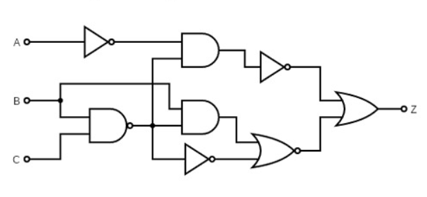

# Penyelesaian Soal Nomor 2 Latihan Soal

## (a) Persamaan Aljabar Boolean Output Z

Berdasarkan penelusuran alur sinyal dari input (A, B, C) melewati setiap gerbang logika (NOT, AND, NAND, NOR, OR) menuju output (Z), didapatkan persamaan boolean utuh sebelum disederhanakan sebagai berikut:

$$Z = \overline{\bar{A} \cdot \overline{BC}} + \overline{(B \cdot \overline{BC}) + BC}$$

---

## Landasan Teori: Teorema Aljabar Boolean yang Digunakan

1. **Teorema De Morgan (De Morgan's Laws):** Digunakan untuk memecah garis negasi panjang (NOT) yang mencakup operasi perkalian (AND) atau penjumlahan (OR).
   * Rumus: $\overline{X \cdot Y} = \bar{X} + \bar{Y}$ dan $\overline{X + Y} = \bar{X} \cdot \bar{Y}$
2. **Hukum Negasi Ganda (Involution Law):** Jika sebuah variabel dinegasikan sebanyak dua kali berturut-turut, maka nilainya akan kembali ke variabel aslinya.
   * Rumus: $\overline{\overline{X}} = X$
3. **Hukum Distributif (Distributive Law):** Memungkinkan penyebaran variabel ke dalam atau ke luar tanda kurung, mirip dengan aljabar matematika biasa.
   * Rumus: $X \cdot (Y + Z) = (X \cdot Y) + (X \cdot Z)$ dan $X + (Y \cdot Z) = (X + Y) \cdot (X + Z)$
4. **Hukum Komplemen (Complement Law):** Mengatur hasil operasi antara sebuah variabel dengan negasinya sendiri.
   * Rumus: $X \cdot \bar{X} = 0$ dan $X + \bar{X} = 1$
5. **Hukum Identitas (Identity Law):** Menyatakan bahwa operasi dengan logika 0 atau 1 pada kondisi tertentu tidak akan mengubah nilai variabel asli.
   * Rumus: $X + 0 = X$ dan $X \cdot 1 = X$
6. **Hukum Redundansi / Absorpsi (Simplification Law):** Bentuk penyederhanaan cepat (jalan pintas) untuk menyerap variabel yang redundan.
   * Rumus: $\bar{X} + XY = \bar{X} + Y$

---

## (b) Penyederhanaan Rangkaian dengan Teorema Aljabar Boolean

Untuk mendapatkan rangkaian yang lebih efisien, persamaan awal di atas disederhanakan menggunakan teorema-teorema Aljabar Boolean yang telah disebutkan. Proses penyederhanaan dibagi menjadi dua bagian:

**1. Menyederhanakan Sisi Kiri (Jalur Atas)**
Persamaan: $\overline{\bar{A} \cdot \overline{BC}}$
Menggunakan **Teorema De Morgan** ($\overline{X \cdot Y} = \bar{X} + \bar{Y}$) dan **Hukum Negasi Ganda** ($\overline{\overline{X}} = X$):
$$= \overline{\overline{A}} + \overline{\overline{BC}}$$
$$= A + BC$$

**2. Menyederhanakan Sisi Kanan (Jalur Bawah)**
Persamaan: $\overline{(B \cdot \overline{BC}) + BC}$
Pertama, selesaikan bagian dalam kurung $(B \cdot \overline{BC})$ dengan **Teorema De Morgan**:
$$B \cdot (\bar{B} + \bar{C})$$
Sebarkan menggunakan **Hukum Distributif**:
$$= B\bar{B} + B\bar{C}$$
Berdasarkan **Hukum Komplemen**, nilai $B\bar{B} = 0$, sehingga:
$$= 0 + B\bar{C} = B\bar{C}$$
Substitusikan kembali ke persamaan awal sisi kanan:
$$= \overline{B\bar{C} + BC}$$
Gunakan **Hukum Distributif** untuk mengeluarkan variabel B:
$$= \overline{B(\bar{C} + C)}$$
Berdasarkan **Hukum Komplemen** ($\bar{C} + C = 1$) dan **Hukum Identitas** ($B \cdot 1 = B$), persamaan menjadi:
$$= \overline{B(1)} = \bar{B}$$

**3. Menggabungkan dan Menyelesaikan Persamaan Akhir**
Gabungkan kembali hasil penyederhanaan sisi kiri dan kanan:
$$Z = (A + BC) + \bar{B}$$
Susun ulang posisinya:
$$Z = A + \bar{B} + BC$$
Sederhanakan bagian $\bar{B} + BC$ menggunakan **Hukum Redundansi / Absorpsi** ($\bar{X} + XY = \bar{X} + Y$):
$$= \bar{B} + C$$

Maka, persamaan akhir yang paling sederhana adalah:
$$Z = A + \bar{B} + C$$

**Kesimpulan Rangkaian Sederhana:**
Dari persamaan akhir tersebut, rangkaian aslinya dapat disederhanakan secara signifikan. Rangkaian sederhana ini hanya membutuhkan satu gerbang **NOT** (untuk membalik nilai B menjadi $\bar{B}$) dan satu gerbang **OR** dengan 3 input (untuk menjumlahkan A, $\bar{B}$, dan C).

---

## (c) Timing Diagram (Berdasarkan Tabel Logika)

Nilai output Z di bawah ini dihitung menggunakan persamaan yang telah disederhanakan ($Z = A + \bar{B} + C$).

| Detik ke- | Input A | Input B | Input C | Output (Z) |
| :---: | :---: | :---: | :---: | :---: |
| 0 | 0 | 0 | 0 | 1 |
| 1 | 1 | 0 | 1 | 1 |
| 2 | 1 | 1 | 0 | 1 |
| 3 | 1 | 0 | 1 | 1 |
| 4 | 0 | 1 | 0 | 0 |
| 5 | 0 | 1 | 1 | 1 |
| 6 | 0 | 0 | 0 | 1 |
| 7 | 1 | 0 | 1 | 1 |
| 8 | 0 | 1 | 0 | 0 |